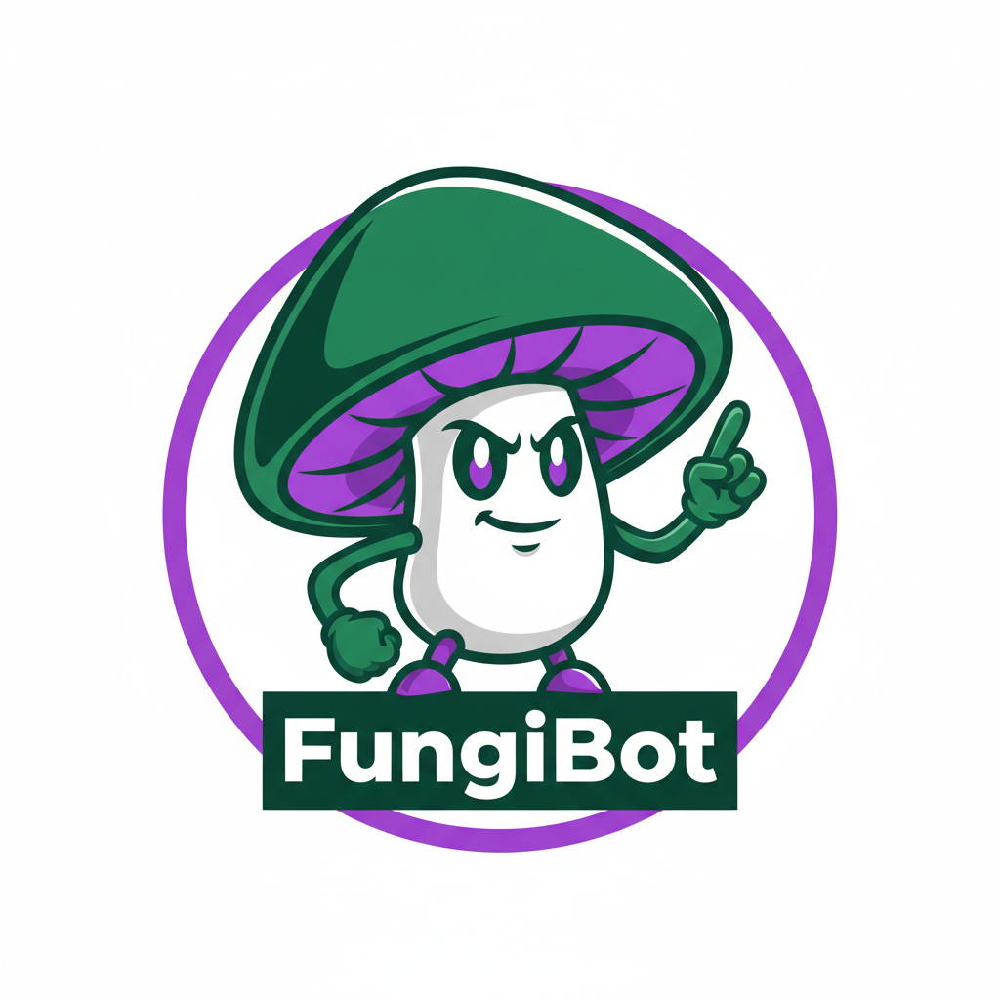
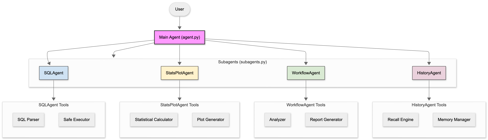

<p align="center">
  
</p>

# 📘 **FungiBot**  
### *Agentic SQL Analysis System for Fungal Genomes*

FungiBot is an intelligent agent built with **Google ADK** that enables natural-language exploration of a **DuckDB** database containing fungal genomes.  
It is designed for researchers who want fast, interactive analysis of genome assemblies, ecological guilds, CAZy profiles, and more—directly through conversational queries.

FungiBot runs entirely **locally** (no cloud dependencies) and works smoothly on HPC systems.

---

# 🚀 Features

### ✔ Natural-language SQL querying  
Ask questions like:  
> “Give me a high-level overview of assembly quality with limit 500.”

FungiBot automatically generates safe SQL queries.

### ✔ Built-in analysis workflows  
High-level multi-step pipelines, including:

- **Assembly Quality Overview**
- **Genome Lifestyle Overview (guild comparison)**

Each workflow generates:
- Summary statistics  
- Correlations  
- Publication-quality plots  
- A structured `analysis_record` saved to local history  

### ✔ Local analysis history  
Automatically stores workflow runs in a lightweight DuckDB database:

- Retrieve past analyses  
- Reproduce results  
- Track parameters and plots over time  

### ✔ Extensible modular tool system  
Tools include:

- SQL tools  
- Plotting tools  
- Stats tools  
- Workflow tools  
- Analysis-history query tools  

You can easily add new tools or subagents as your project grows.

---

# 📁 Project Structure

```
fungi_bot/
    agent.py                 # Main ADK agent definition
    subagents.py             # Subagents used as tools for main agent
    tools/
        sql_tools.py         # DuckDB SQL wrappers
        plot_tools.py        # Automated plotting
        stats_tools.py       # Summary + correlations
        workflows.py         # High-level analyses
        history_store.py     # Local analysis-history manager
        history_helpers.py   # Data model for AnalysisRecord
    database/
        test_function.duckdb # Small test database (bundled)
        function.duckdb      # Full database (ignored by git)
```

---

<p align="center">
  
</p>

# ⚙️ Installation

First setup API key by creating an account at [Google AI Studio](https://aistudio.google.com/) 

Follow instructions for generating an API key [here](https://aistudio.google.com/app/api-keys)  

FungiBot uses a reproducible Conda environment.

```bash
git clone git@github.com:nfmathieu94/fungi-bot.git
cd fungibot
echo "GOOGLE_API_KEY=YOURAPIKEY" > .env
conda env create -f environment.yml
conda activate fungibot
```

---

# 🗂 Database Setup

### **Included**
- `database/test_function.duckdb`  
  A compact test database (~200 genomes) for quick exploration.

### **Optional: Use the full fungal database**

Set the environment variable:

```bash
export FUNGI_DB_PATH=/path/to/function.duckdb
```

Or for one-off runs:

```bash
FUNGI_DB_PATH=/path/to/function.duckdb adk run .
```

If `FUNGI_DB_PATH` is not set, FungiBot automatically loads the bundled **test database**.

---

# ▶️ Running FungiBot

### **1. Using the ADK CLI (recommended)**

From the project root to launch an interactive prompt:

```bash
adk run .
```
---

# 📊 Example Queries

### Assembly quality

```
Give me a high-level overview of assembly quality with limit 200.
```
```
Show me the N50 distribution across all genomes.
```

### CAZy enzymes

```
Summarize the counts of CAZy HMM families per genome.
```

### Guild comparisons

```
How does genome size vary across ecological guilds?
```

### History lookup

```
Show me my last assembly quality overview runs.
```

---

# 🧠 Local Analysis History

Every workflow returns a structured `analysis_record`, which is automatically saved to:

```
database/analysis_history.duckdb
```

You can retrieve history using natural language:

```
Find my last ecological guilds overview run.
```

Or list all analysis runs:

```
Show me everything I have analyzed this week.
```

---

# 🤝 Contributing

Contributions are welcome!

You can help by adding:

- New analysis workflows  
- Additional SQL or plotting tools  
- Subagents (e.g., CAZyAgent, GuildAgent, AssemblyAgent)  
- Better sample test datasets  
- Documentation or examples  

---

# 📄 License

MIT License
